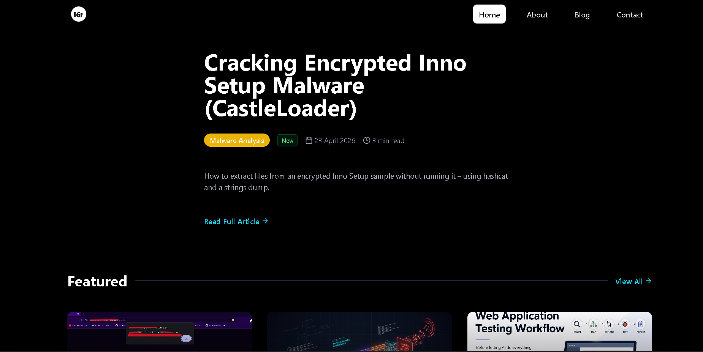

# 0xi6r Labs

This repository contains the source code for my personal portfolio website and its supporting backend services.

## Status
✅ **Stable** — The portfolio is production-ready and actively maintained.

## Overview
The site showcases my work, projects, and research with a focus on performance, simplicity, and clean design. Everything currently implemented is functional and tested as intended.

## Usage
Feel free to explore, learn from, or adapt parts of the code for your own projects. If you run into issues or have suggestions, feel free to reach out.

## License
Open for personal and educational use. Credit is appreciated for significant reuse.
